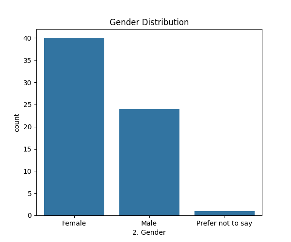
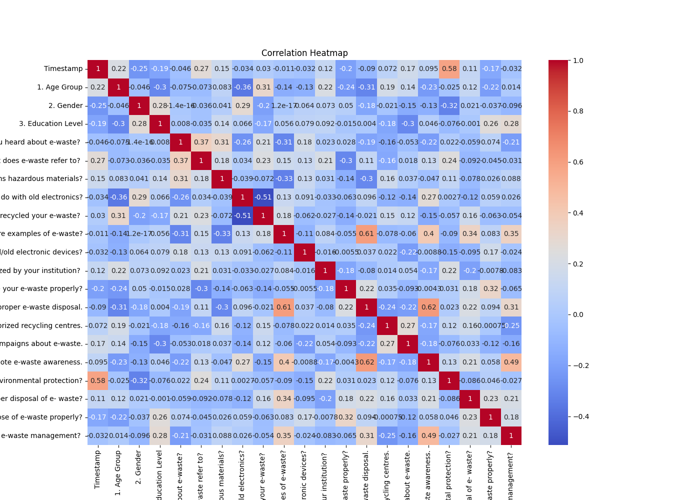
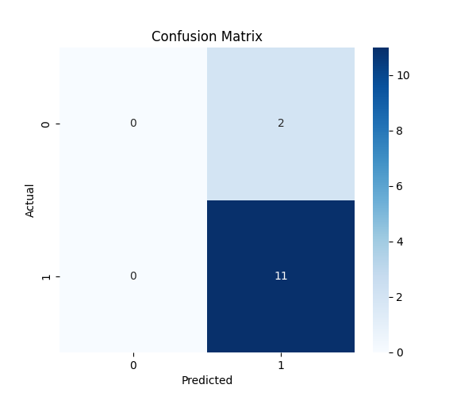
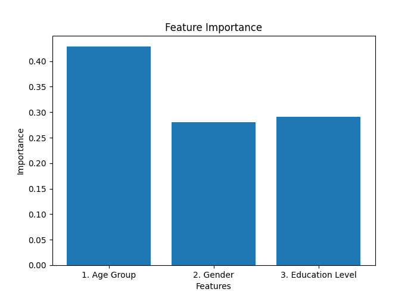

# ♻️ E-Waste Awareness Analysis using Hypothesis Testing & Machine Learning


## 📌 Project Overview


This project presents a comprehensive analysis of **E-Waste awareness and disposal behavior** using survey data collected through Google Forms. The study integrates **statistical hypothesis testing**, **machine learning**, and **data visualization** techniques to evaluate awareness patterns and identify demographic factors influencing responsible E-Waste management.


The project was developed as part of a **Business Research Methods (BRM)** study using Python-based analytical tools.


---


# 🎯 Objectives


* Analyze awareness regarding E-Waste among respondents

* Examine the relationship between gender and E-Waste awareness

* Study ownership patterns of unused electronic devices

* Apply Chi-Square Hypothesis Testing

* Predict awareness levels using Machine Learning

* Identify the most influential demographic factors affecting awareness


---


# 🛠️ Tech Stack


| Technology   | Purpose                   |

| ------------ | ------------------------- |

| Python       | Programming Language      |

| Pandas       | Data Analysis             |

| NumPy        | Numerical Computation     |

| Matplotlib   | Data Visualization        |

| Seaborn      | Statistical Visualization |

| Scikit-Learn | Machine Learning          |

| SciPy        | Hypothesis Testing        |

| PyCharm      | Development Environment   |


---


# 📂 Dataset Information


| Attribute | Details                 |

| --------- | ----------------------- |

| Source    | Google Forms Survey     |

| Responses | 65                      |

| Variables | 21                      |

| Data Type | Categorical Survey Data |


The dataset includes:


* Demographic information

* E-Waste awareness

* Recycling behavior

* Disposal practices

* Environmental concerns

* Awareness campaign exposure


---


# 📊 Exploratory Data Analysis


## 📌 Gender Distribution


The following visualization represents respondent distribution across gender categories.


### 🔗 Image Link


[View Gender Distribution Graph](images/gender_distribution.png)





### 📈 Key Observation


* Female respondents constituted the majority of survey participants.

* Male respondents formed the second-largest respondent group.

* Very few respondents selected “Prefer not to say”.


---


# 🔥 Correlation Heatmap


The correlation heatmap below illustrates relationships between encoded survey variables.


### 🔗 Image Link


[View Correlation Heatmap](images/heatmap.png)





### 📈 Insights


* Awareness-related variables demonstrated moderate positive correlations.

* Gender showed relatively weak correlation with awareness indicators.

* Age and education displayed stronger influence on awareness behavior.


---


# 📈 Statistical Hypothesis Testing


## 🧪 Hypothesis 1


### Null Hypothesis (H₀)


Gender and E-Waste awareness are statistically independent.


### Alternative Hypothesis (H₁)


Gender and E-Waste awareness are statistically dependent.


---


### 📊 Chi-Square Test Results


| Parameter            | Value  |

| -------------------- | ------ |

| Chi-Square Statistic | 0.0993 |

| P-value              | 0.9515 |

| Degrees of Freedom   | 2      |


### ✅ Conclusion


Since the p-value exceeded the significance level of 0.05, the null hypothesis was accepted.


**Gender and E-Waste awareness were found to be statistically independent.**


---


## 🧪 Hypothesis 2


### Null Hypothesis (H₀)


Gender and ownership of unused electronic devices are statistically independent.


### Alternative Hypothesis (H₁)


Gender and ownership of unused electronic devices are statistically dependent.


---


### 📊 Chi-Square Test Results


| Parameter            | Value  |

| -------------------- | ------ |

| Chi-Square Statistic | 0.5296 |

| P-value              | 0.7673 |

| Degrees of Freedom   | 2      |


### ✅ Conclusion


Since the p-value exceeded 0.05, the null hypothesis was accepted.


**Gender and ownership of unused electronic devices were found to be statistically independent.**


---


# 🤖 Machine Learning Analysis


## 📌 Model Used


* Random Forest Classifier


## 📌 Input Features


* Age Group

* Gender

* Education Level


## 📌 Target Variable


* E-Waste Awareness


---


# 📊 Model Performance


| Metric   | Value |

| -------- | ----- |

| Accuracy | 84.6% |


The Random Forest model successfully predicted awareness levels using demographic variables with strong overall performance.


---


# 📉 Confusion Matrix


The confusion matrix below evaluates classification performance by comparing actual and predicted values.


### 🔗 Image Link


[View Confusion Matrix](images/confusion_matrix.png)





### 📈 Interpretation


* The model accurately identified the majority awareness class.

* Dataset imbalance influenced prediction performance for minority responses.


---


# ⭐ Feature Importance Analysis


Feature importance analysis identifies the variables contributing most significantly to awareness prediction.


### 🔗 Image Link


[View Feature Importance Graph](images/feature_importance.png)





### 📈 Key Findings


* **Age Group** emerged as the strongest predictor of awareness.

* **Education Level** also showed meaningful influence.

* **Gender** demonstrated comparatively lower predictive importance.


---


# 🧹 Data Preprocessing


The following preprocessing steps were performed before analysis:


* Null value detection

* Duplicate removal

* Label Encoding for categorical variables

* Correlation analysis

* Data visualization


---


# 📁 Project Structure


```bash

EWaste-Awareness-Analysis/

│

├── data/

│   └── brm.xlsx

│

├── images/

│   ├── gender_distribution.png

│   ├── heatmap.png

│   ├── confusion_matrix.png

│   ├── feature_importance.png

│

├── report/

│   └── BRM_Report.pdf

│

├── src/

│   └── ewaste_ml_analysis.py

│

└── README.md

```


---


# ▶️ Installation & Execution


## 1️⃣ Clone Repository


```bash

git clone https://github.com/your-username/EWaste-Awareness-Analysis.git

```


## 2️⃣ Install Dependencies


```bash

pip install pandas numpy matplotlib seaborn scikit-learn scipy openpyxl

```


## 3️⃣ Run the Project


```bash

python ewaste_ml_analysis.py

```


---


# 📌 Key Findings


* Most respondents were already aware of E-Waste.

* Gender did not significantly influence awareness levels.

* Gender did not significantly affect ownership of unused electronic devices.

* Age Group emerged as the strongest predictor of awareness.

* Machine learning achieved strong predictive performance using demographic variables.


---


# 🚀 Future Enhancements


* Expand dataset size for broader analysis

* Apply advanced classification algorithms

* Address class imbalance using SMOTE

* Develop interactive dashboards using Power BI

* Deploy the project as a Streamlit web application


---


# 📖 Conclusion


This project demonstrates the integration of **statistical hypothesis testing** and **machine learning techniques** to analyze E-Waste awareness and disposal behavior. The study highlights how predictive analytics and statistical analysis can be combined to derive meaningful insights from survey-based research data.


---


# 👨‍💻 Author


## Lakshya Gautam


MBA in AI & Data Science

RV University


